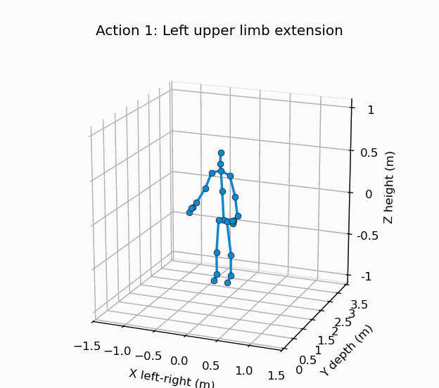
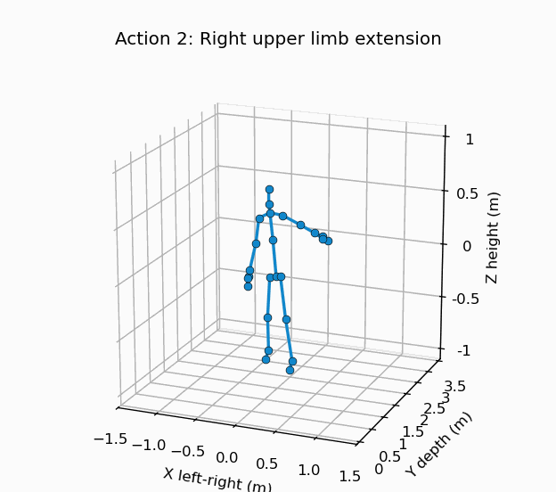
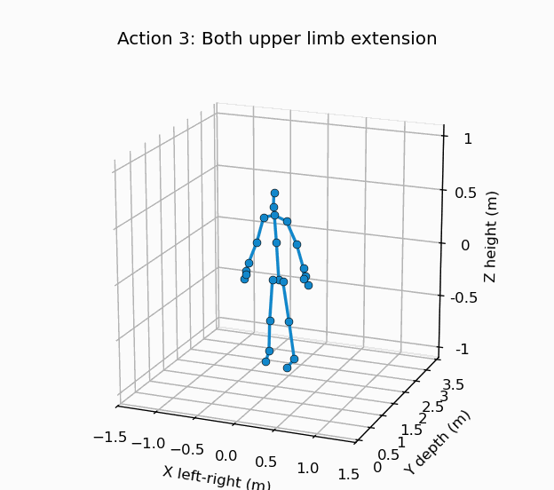
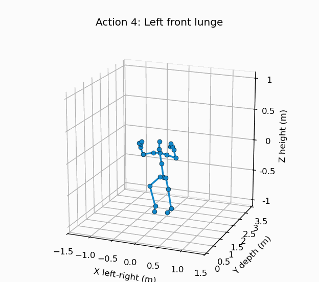
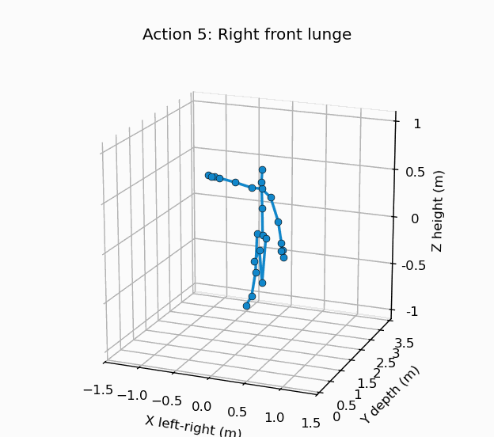
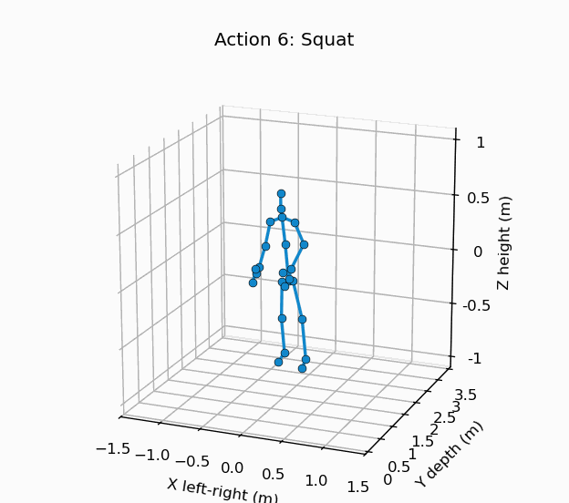
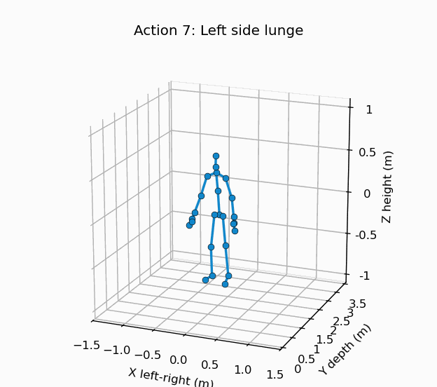
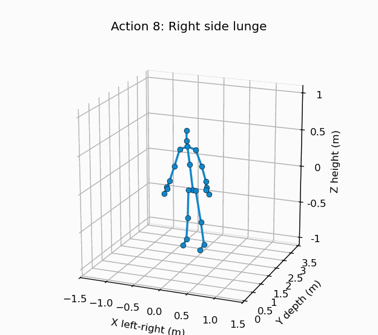
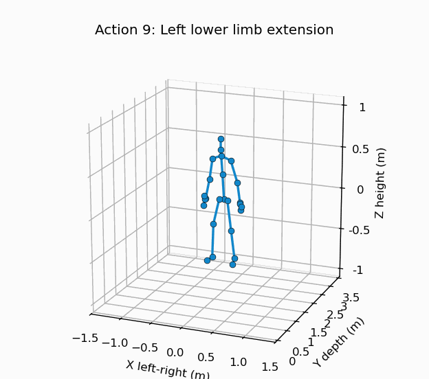
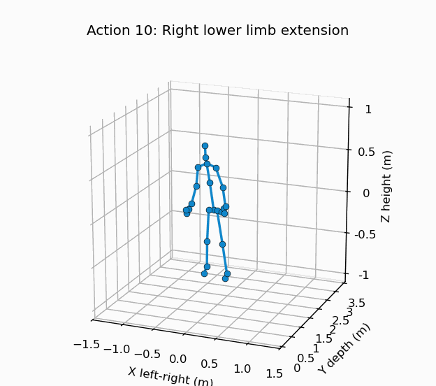

# AI_-driven-human-rehabilitation-mmWave-sensors-
Capstone project

## Movement Dataset

The figure below shows ten different movements we evaluate in our dataset.

They are:

| Action | Preview |
|---:|---|
| 1. Left upper limb extension |  |
| 2. Right upper limb extension |  |
| 3. Both upper limb extension |  |
| 4. Left front lunge |  |
| 5. Right front lunge |  |
| 6. Squat |  |
| 7. Left side lunge |  |
| 8. Right side lunge |  |
| 9. Left lower limb extension |  |
| 10. Right lower limb extension |  |

Here is an example of estimation, compare with the ground truth.
